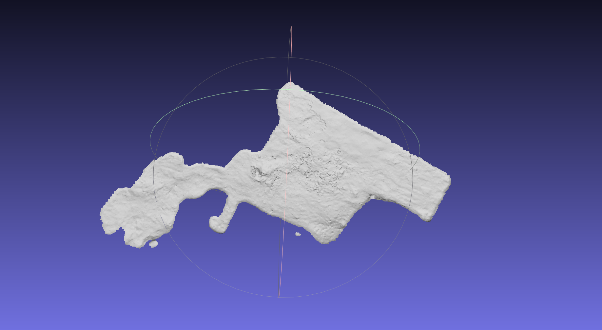
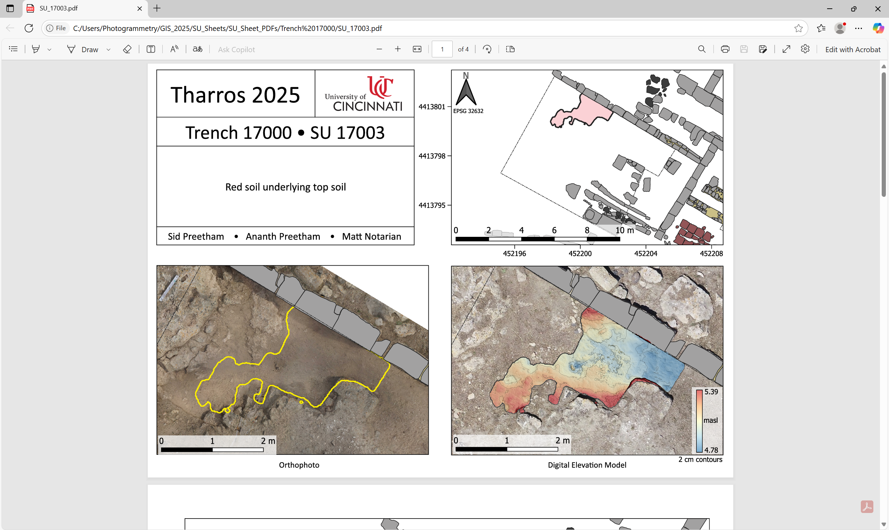

# SU Sheet Builder

Code to automate building **SU (Stratigraphic Unit) Sheets** for the Tharros Archaeological Project. It turns shapefiles and 3D volumetrics into structured PDF reports and QGIS projects.



*Into beautiful PDFs and QGS projects like this:*



---

## What This Code Does

The pipeline does three main things:

1. **Converts 3D SU geometry to 2D GIS shapefiles**  
   Takes OBJ files from photogrammetry/volumetrics (e.g. `SU_17001_top.obj`) and produces projected polygon shapefiles (e.g. `SU_17001_EPSG_32632.shp`) for use in QGIS.

2. **Builds a QGIS map for each SU**  
   For each stratigraphic unit it loads a base project, adds the relevant layers (drone basemap, orthophoto, DEM, contours, trench boundaries, architecture, SU polygon), styles them, and configures map extents and scale bars.

3. **Exports multi-page PDF “SU sheets”**  
   Uses trench-specific layout templates (`.qpt`) to generate a PDF per SU with title, description, overview map, ortho map, DEM/contour map, and elevation legend—ready for archaeological documentation.

---

## How It Works

### High-level flow

```
SU Top OBJ (optional) → 2D SU shapefile → Load QGIS project + layers
       → Clip DEM to SU → Generate contours → Fill layout template → Export PDF
```

- **If the SU shapefile already exists** (e.g. in `GIS_2025/3D_SU_Shapefiles/`), it is used as-is.
- **If it does not exist**, the script can create it from the corresponding `SU_*_top.obj` in `Volumetrics_2025/SU Top OBJs/` using Blender (headless) and QGIS processing (see [Shapefile generation](#shapefile-generation-from-obj) below).

For each SU, the code then:

1. Loads the base QGIS project (e.g. `TARP_SU_Sheets_2025.qgs`).
2. Clears existing layers and adds a drone-flight basemap.
3. Adds the orthophoto for the given **job ID** (from the `Orthos/` folder).
4. Adds trench overview boundary, trench boundaries, and architecture layers.
5. Adds the SU polygon layer (from the shapefile).
6. Clips the DEM (from `DEM/`, matched by job ID) to the SU polygon.
7. Generates contours from the clipped DEM (default 2 cm interval) and adds them with a style.
8. Adds the DEM (with high-contrast color ramp and optional hillshade) and elevation stats.
9. Instantiates a **SUSheet** with a trench-specific layout template (e.g. `SU_Layout_Templates/SU_Template_17000.qpt`).
10. Fills title, description, map extents, scale bars, and elevation legend; then exports the layout to PDF.

Errors for individual SUs can be caught and logged (e.g. to `error_log.txt`) so the batch continues.

---

## Main Scripts and Modules

| File | Purpose |
|------|--------|
| **`generate_su_sheets.py`** | Entry point: starts QGIS, loops over `(su, job_id)` pairs, calls `generate_SU_Sheet()` for each, skips if the output PDF already exists, logs errors, then closes QGIS. Configure `PATH`, `QGS_FILE_NAME`, and the list of `(su, job_id)` here. |
| **`qgs_su_sheets_utils.py`** | Core logic: QGIS lifecycle (`start_QGS` / `close_QGS`), project setup, layer loading (ortho, DEM, contours, trench, architecture, SU shapefile), DEM styling and clipping, contour generation, **SUSheet** class (load `.qpt`, fill maps and labels, export PDF), and **`generate_SU_Sheet()`** which runs the full pipeline for one SU. |
| **`generate_top_shp.py`** | Converts one SU 3D OBJ to a 2D polygon shapefile: Blender (headless + BlenderGIS) exports a temp shapefile, then QGIS processing fixes geometry, dissolves, deletes holes, translates to project coordinates (e.g. EPSG:32632), adds Year/Trench/SU fields, and saves `SU_<n>_EPSG_32632.shp`. |
| **`create_shp_files_in_bulk_from_volumetrics.py`** | Batch job: starts QGIS, scans `Volumetrics_2025/SU Top OBJs/` for `SU_*.obj`, and for each OBJ without an existing shapefile in `GIS_2025/3D_SU_Shapefiles/` calls `create_SU_shp_file()`. Logs progress and errors (e.g. `shp_error_log.txt`). |
| **`DrawMasks.py`** | Minimal helper: loads a QGIS project (e.g. `TARP_2025_SU_Template.qgs`). Used for manual or legacy workflows. |

---

## Shapefile generation from OBJ

When an SU shapefile is missing, `generate_top_shp.create_SU_shp_file()` is used (from `qgs_su_sheets_utils` or from the bulk script). It:

1. **Blender (headless)**  
   Uses Blender with the BlenderGIS addon to import the OBJ and export a temporary polygon shapefile (`POLYGONZ`, obj-to-feature). Blender is expected under standard install paths (e.g. `Program Files\Blender Foundation` on Windows, or `Applications` on macOS). A small script is written to `~/SU_tool/Run BlenderGIS headless.py` and invoked with the OBJ path.

2. **QGIS processing**  
   - Fix geometries → Dissolve → Delete holes → Fix geometries again.  
   - Save local-coordinate shapefile: `SU_<n>_LC.shp`.  
   - Translate by a fixed offset (e.g. `DELTA_X`, `DELTA_Y`) and assign CRS **EPSG:32632**.  
   - Add integer fields: **Year**, **Trench** (derived from SU number), **SU**.  
   - Save projected shapefile: `SU_<n>_EPSG_32632.shp`.

So the “top” OBJ is effectively turned into a 2D footprint in project coordinates for use in the SU sheet maps and DEM clipping.

---

## Data and project layout (expected by the code)

Paths are currently hard-coded or built from variables (e.g. `PATH = "C:\\Users\\Photogrammetry"`). The logic expects a structure along these lines:

- **Base path** (e.g. `PATH`): root for photogrammetry/GIS data.
- **`PATH/AutomateRockMask/`** (or equivalent): script location; output PDFs (e.g. `SU_Sheets/SU_Sheet_PDFs/<SU>.pdf`), error logs.
- **`PATH/GIS_2025/3D_SU_Shapefiles/`**: SU polygon shapefiles (`SU_<n>_EPSG_32632.shp`).
- **`PATH/Volumetrics_2025/SU Top OBJs/`**: OBJ files (`SU_<n>_top.obj`) used when generating shapefiles.
- **`PATH/Orthos/`**: Orthophoto JPGs; filename pattern used to match **job ID** (e.g. `*_<job_id>_*.jpg`).
- **`DEM/`**: DEM GeoTIFFs; filename must contain `Pgram_Job_<job_id>` (e.g. `Pgram_Job_707_...tif`).
- **`GCP-Drone-Flight-2025.jpg`**: Basemap raster used in the project.
- **`SU_Layout_Templates/`**: One `.qpt` per trench, e.g. `SU_Template_17000.qpt`, `SU_Template_18000.qpt`.
- **`Styles/`**: QML style files (e.g. contour, DEM hillshade, SU outlines, trench, architecture).
- **Trench/architecture shapefiles**: e.g. `TARP 2025 Trench Boundaries 6-1-2025.shp`, `Architecture_2025.shp`, and trench overview boundary (e.g. `*_Overview_Zoom_Rough_Boundary.shp`).

The **QGIS project template** (e.g. `TARP_SU_Sheets_2025.qgs`) and **QGIS install path** (e.g. `C:\Program Files\QGIS 3.40.8`) are set in the scripts; adjust these for your machine and project.

---

## SUSheet layout (PDF content)

The **SUSheet** class in `qgs_su_sheets_utils.py` assumes a multi-page layout template with:

- **Page 1**: DEM map, Ortho map, Overview map; title (e.g. “Trench 17000 • SU 17001”), description, scale bars, elevation legend (min/max).
- **Page 2**: Overview map (and scale bar).
- **Page 3**: Ortho map (and scale bar).
- **Page 4**: DEM map and elevation legend.

It looks up layout items by display name (e.g. “DEM Page 1”, “Ortho Page 1”, “Overview Page 1”, “Scalebar DEM Page 1”, “Lower/ Higher Elevation Page 1/4”, “Description:”). It sets map extents from the SU layer (with optional buffer), links scale bars to the correct map and width, applies layer visibility and styles (overview vs ortho vs DEM), then exports the layout to PDF.

---

## Requirements and environment

- **Python 3** with dependencies in `requirements.txt` (PyQt5; used by QGIS Python bindings).
- **QGIS 3.x** (e.g. 3.40.8) with its Python environment; scripts are intended to be run with QGIS’s Python (e.g. `python-qgis-ltr.bat` or similar) so that `qgis.core` and `processing` are available. The code appends QGIS paths to `sys.path` for use outside the QGIS GUI.
- **Blender** with **BlenderGIS** addon (only if you generate shapefiles from OBJ). Blender is used in headless mode; the addon name in the command is `BlenderGIS-master`.

---

## How to run

1. **Single SU sheet (with existing shapefile)**  
   In `generate_su_sheets.py`, set `PATH`, `QGS_FILE_NAME`, and a single `(su, job_id)` in the loop, then run with QGIS Python:
   ```bash
   # Example (adjust to your QGIS Python)
   python generate_su_sheets.py
   ```

2. **Batch SU sheets**  
   Edit the list of `(su, job_id)` in `generate_su_sheets.py` (and ensure orthos/DEMs exist for each job ID). Run the same script; it will skip SUs that already have an output PDF and log failures.

3. **Bulk shapefile creation from OBJs**  
   Set `PATH` and `YEAR` in `create_shp_files_in_bulk_from_volumetrics.py`, then run with QGIS Python. It will create only missing `SU_*_EPSG_32632.shp` files from `Volumetrics_2025/SU Top OBJs/`.

4. **DrawMasks**  
   Run `DrawMasks.py` with QGIS Python to load the template project; adjust the project path inside the script if needed.

---

## Coming soon

- More detailed user documentation.
- Portrait view option for SU sheets.
